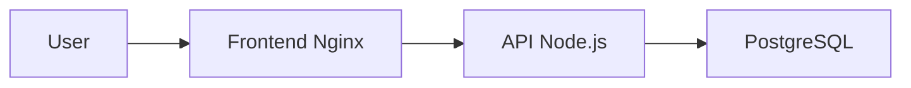

# VitalSync

Application de suivi medical et sportif conteneurisee avec pipeline CI/CD.

## Architecture



- **Frontend** : page HTML servie par Nginx, proxy vers l'API
- **Backend** : API REST Node.js / Express (port 3000)
- **Base de donnees** : PostgreSQL 15

## Prerequis

- Docker et Docker Compose
- Node.js 20 (pour le developpement local)
- kubectl (pour le deploiement Kubernetes)

## Lancement rapide

```bash
# Copier les variables d'environnement
cp .env.example .env

# Lancer les 3 services
docker-compose up -d

# Verifier que tout tourne
docker ps
curl http://localhost:3000/health
```

## Commandes utiles

| Commande | Description |
|----------|-------------|
| `docker-compose up -d` | Demarrer tous les services |
| `docker-compose down` | Arreter tous les services |
| `docker-compose logs -f` | Voir les logs en temps reel |
| `cd backend && npm test` | Lancer les tests |
| `cd backend && npx eslint .` | Lancer le linter |

## Pipeline CI/CD

Le workflow GitHub Actions (`.github/workflows/ci.yml`) s'execute sur chaque push sur `develop` et chaque PR vers `main`. Il comporte 3 jobs :

1. **lint-and-test** : installe les dependances, execute ESLint et les tests Jest
2. **build-and-push** : construit les images Docker et les pousse sur GHCR
3. **deploy-staging** : deploie avec docker-compose et effectue un health check

## Deploiement Kubernetes

Les manifestes se trouvent dans le dossier `k8s/` :

```bash
kubectl apply -f k8s/secret.yaml
kubectl apply -f k8s/deployment.yaml
kubectl apply -f k8s/service.yaml
kubectl apply -f k8s/ingress.yaml
```

## Structure du projet

```
vitalsync/
├── backend/
│   ├── server.js
│   ├── package.json
│   ├── Dockerfile
│   └── test/
│       └── health.test.js
├── frontend/
│   ├── index.html
│   ├── nginx.conf
│   └── Dockerfile
├── k8s/
│   ├── deployment.yaml
│   ├── service.yaml
│   ├── ingress.yaml
│   └── secret.yaml
├── .github/workflows/ci.yml
├── docker-compose.yml
└── .env.example
```
